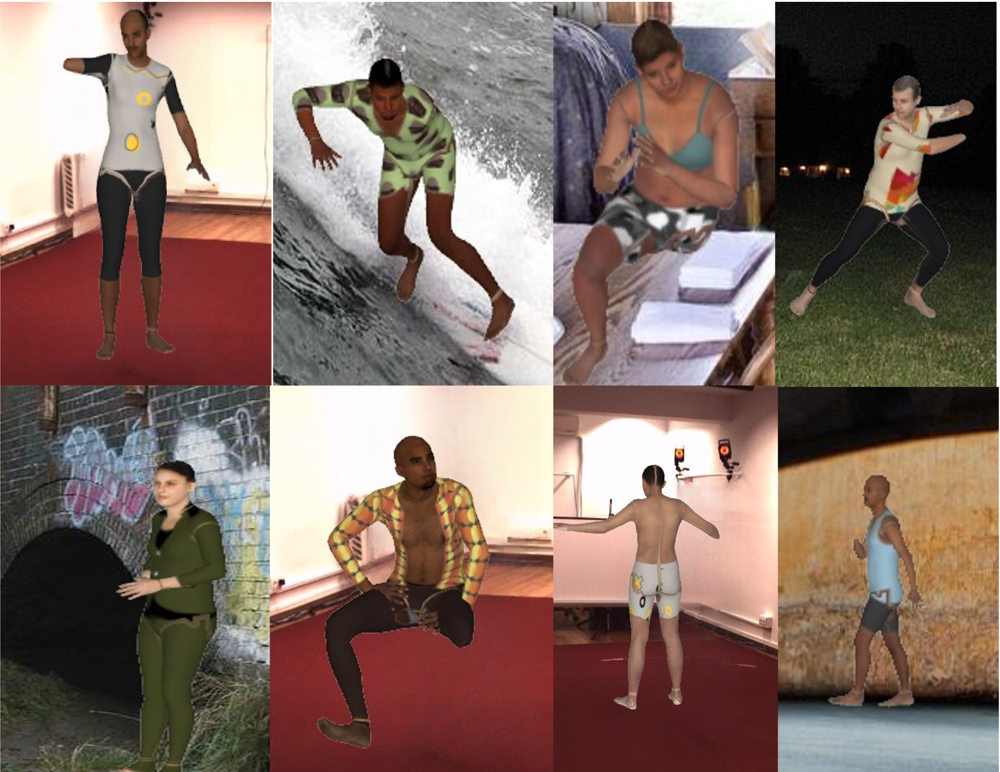
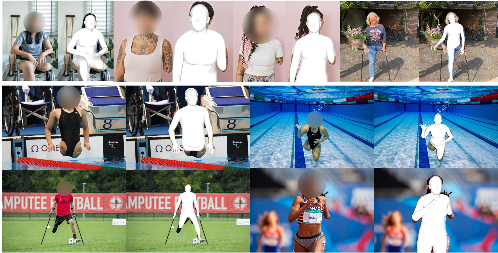

<div align="center">

# AJAHR: Amputated Joint Aware 3D Human Mesh Recovery


### International Conference on Computer Vision (ICCV 2025)

<p>
  <strong><a href="https://chojinie.github.io/categories/">Hyunjin Cho</a><sup>*</sup></strong>, 
  <strong>Giyun Choi<sup>*</sup></strong>, 
  Jongwon Choi<sup>†</sup>
</p>

<p>
  <sup>*</sup> Equal contribution &nbsp;&nbsp;&nbsp;
  <sup>†</sup> Corresponding author
</p>

[](https://arxiv.org/abs/2509.19939) [](https://chojinie.github.io/project_AJAHR/)

</div>

---

## Key Idea



Conventional SMPL-based mesh recovery assumes a fully intact human body, causing instability when applied to amputee subjects, as the model attempts to hallucinate non-existent limbs.

To overcome this, we introduce A3D (Amputee 3D Dataset) — a dataset that embeds real amputee configurations, applies joint removal with visibility-aware masking, and defines 12 anatomical amputation regions via AJAHR Index, including all child SMPL joints for each region.

Built with real-world and studio-rendered scenes, A3D includes mesh overlays, ethnicity-aware skin tones, and varied clothing textures, enabling robust amputee-aware mesh regression beyond standard COCO/H36M assumptions.

## Dataset Access

To ensure that the dataset is used **strictly for academic and research purposes**, interested parties are required to complete this request form. Please provide information regarding your **intended use**, **institutional affiliation**, and any **relevant ongoing projects**. Your request will be reviewed, and further instructions will be provided upon approval.

🔗 **Request Form:** [https://forms.gle/z5QGfXP9PxzSZM9F8](https://forms.gle/z5QGfXP9PxzSZM9F8)

---

## Dataset Structure

The A3D / AJAHR dataset follows a unified directory structure.

```plaintext
AJAHR_Dataset/
├── COCO_train/
│   ├── Images/
│   └── annotation/
│
├── MPII/
│   ├── Images/
│   └── annotation/
│
├── COCO_val/
│   ├── Images/
│   └── annotation/ ← Evaluation Set
│
└── H36M/
    ├── annotation/
    └── Images/
        ├── S1/
        ├── S5/
        ├── S6/
        ├── S7/
        ├── S8/
        ├── S9/
        └── S11/   ← Evaluation Set
```

## Dataset: AJAHR Index & SMPL Mapping


To support amputated-joint aware mesh reconstruction research, we release **AJAHR-Index**, a joint-group annotation protocol aligned with the SMPL kinematic hierarchy.

```
ajahr_index : {
    0 : Right Hand, 1 : Right Elbow, 2 : Right Shoulder,
    3 : Left Hand, 4 : Left Elbow, 5 : Left Shoulder,
    6 : Left Foot, 7 : Left Knee, 8 : Left Hip,
    9 : Right Foot, 10: Right Knee, 11: Right Hip
}

smpl_index : { 
    21, 23 : Right Hand,      19, 21, 23 : Right Elbow,      17, 19, 21, 23 : Right Shoulder,
    20, 22 : Left Hand,       18, 20, 22: Left Elbow,        16, 18, 20, 22 : Left Shoulder,
    7, 10 : Left Foot,        4, 7, 10 : Left Knee,          1, 4, 7, 10 : Left Hip,
    8, 11 : Right Foot,       5, 8, 11 : Right Knee,         2, 5, 8, 11 : Right Hip
}
```

> **Note:** `ajahr_index` indicates an amputation region. When an index is marked as amputated, **the corresponding region and all of its descendant joint nodes** are treated as missing. `smpl_index` refers to the **actual SMPL pose joint indices** mapped to each anatomical region.

### Label Extraction Policy (Automatic from `imgname`)
Following the AJAHR framework design, labels are not manually annotated but are implicitly derived from the file naming convention, ensuring scalability and consistency across amputee and non-amputee datasets.

AJAHR does **not** store explicit class labels inside annotation files. Instead, **each sample's amputation level is inferred directly from its `imgname` pattern**, following the logic below:
    
```python
if 'imgname' in self.data:
    self.labels = []
    for file_name in self.imgname:
        amp_number = extract_amp_number(file_name)
        if amp_number is not None:
            self.labels.append(amp_number)
        else:
            self.labels.append(12)
    self.labels = np.array(self.labels)
else:
    #for non-amputee datasets
    self.labels = np.full((self.scale.shape[0],), 12)
```

* `amp_number ∈ {0 ~ 11}` → matches **AJAHR Index** (see mapping above)
* `12` is reserved for the **Non-amputee (default) class**
* Example filename: `amp_3_XXXXXXX.png → label = 3 (Right Elbow)`

---

## Dataset Structure: AJAHR Index & SMPL Mapping

**COCO / MPII Based Annotations**

```
center               → shape: (N, 1, 2),  dtype: float64
scale                → shape: (N, 1),     dtype: float64
imgname              → shape: (N,),       dtype: object
global_orient        → shape: (N, 1, 3, 3), dtype: float32
body_pose            → shape: (N, 72),    dtype: float32
has_body_pose        → shape: (N,),       dtype: float32
betas                → shape: (N, 10),    dtype: float32
has_betas            → shape: (N,),       dtype: float32
body_keypoints_2d    → shape: (N, 25, 3), dtype: float64  # indices 0~24 = body
extra_keypoints_2d   → shape: (N, 19, 3), dtype: float64  # indices 25~43 = extra
body_keypoints_3d    → shape: (N, 25, 4), dtype: float64  # indices 0~24 = body
extra_keypoints_3d   → shape: (N, 19, 4), dtype: float64  # indices 25~43 = extra
body_opt_3d_joints   → shape: (N, 25, 1), dtype: float64
extra_opt_3d_joints  → shape: (N, 19, 1), dtype: float64
```

**H36M Based Annotations**

```
imgname     → shape: (N,),             dtype: <U44>
scale       → shape: (N, 1),           dtype: float64
center      → shape: (N, 1, 2),        dtype: float64
ajahr_conf  → shape: (N, 12),          dtype: int64
global_orient → shape: (N, 1, 1, 3, 3), dtype: float64
gt_2d_kpts  → shape: (N, 1, 44, 3),    dtype: float64  # 0~24 body, 25~43 extra
gt_3d_kpts  → shape: (N, 1, 44, 5),    dtype: float64  # 0~24 body, 25~43 extra
smpl_pose   → shape: (N, 1, 23, 3, 3), dtype: float64
smpl_shape  → shape: (N, 1, 10),       dtype: float64
cam_t       → shape: (N, 1, 3),        dtype: float64
```

## Trained Framework Output Assets

The following examples showcase AJAHR-trained mesh regression results on real amputee scenarios. Leveraging the A3D dataset and the amputation-aware joint representation, the framework successfully reconstructs consistent, anatomically valid SMPL meshes even when major limb regions are missing.

### A3D Evaluation Dataset Evaluation


### 3DPW (Non-amputee) Dataset Evaluation


### ITW-Amputee Dataset Evalutation



> These results demonstrate that AJAHR, trained on A3D, leverages BPAC-Net's amputation region classification to avoid hallucinating non-existent limbs, instead generating structurally valid meshes that adapt to the underlying amputee anatomy. Furthermore, this indicates that the proposed framework effectively reduces the representation gap between synthetic A3D training data and real-world amputee imagery.

---

## 📚 Citation

If you find **AJAHR** useful in your research, please consider citing:

```bibtex
@misc{cho2025ajahramputatedjointaware,
      title={AJAHR: Amputated Joint Aware 3D Human Mesh Recovery},
      author={Hyunjin Cho and Giyun Choi and Jongwon Choi},
      year={2025},
      eprint={2509.19939},
      archivePrefix={arXiv},
      primaryClass={cs.GR},
      url={https://arxiv.org/abs/2509.19939},
}
